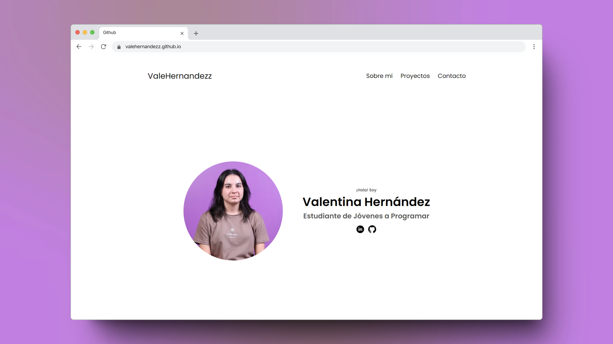
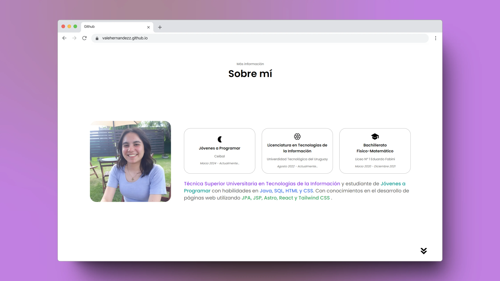
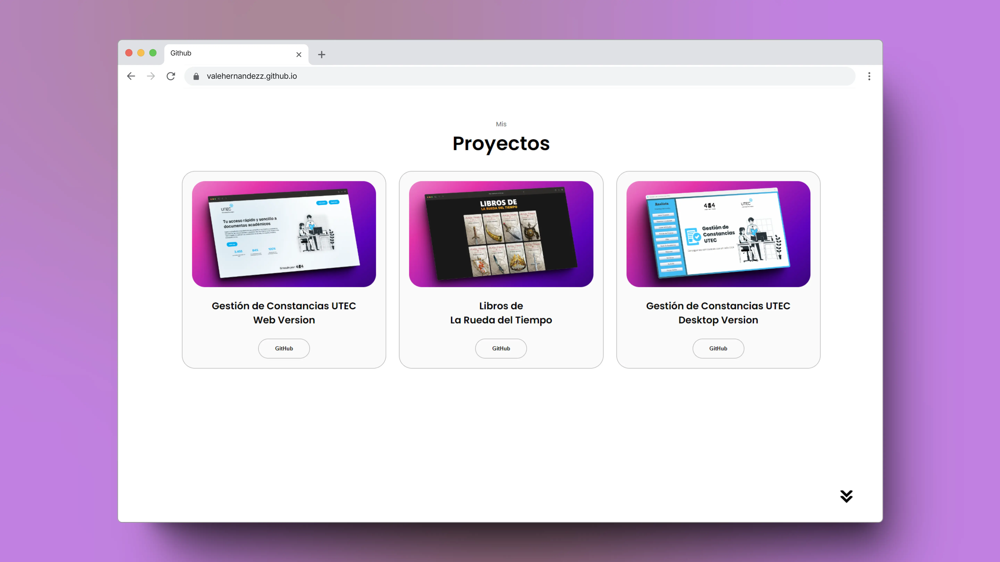
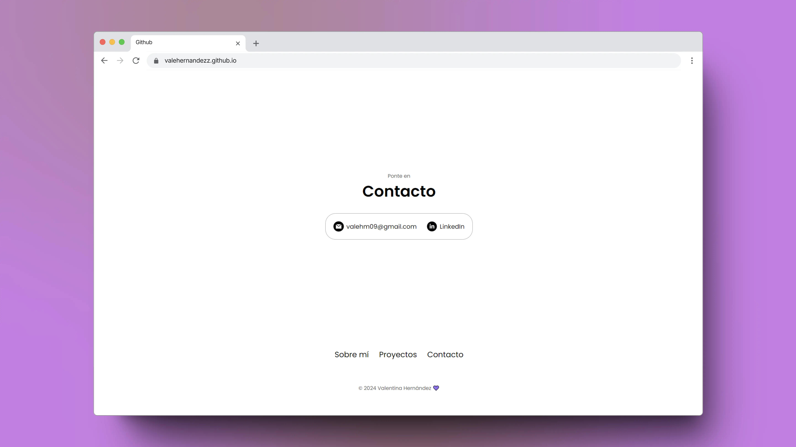

# 🖥 Portafolio de Valentina Hernández

**Técnica Superior Universitaria en Tecnologías de la Información** disponible para contratación en el desarrollo de software. Conocimientos sólidos y capacidad para abordar proyectos tecnológicos. Para consultas laborales, por favor, póngase en contacto.

## 🛠 Construido con

- 
- 

## 👩‍💻 Sobre mí

